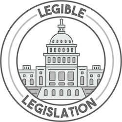

# Legible Legislation

## Understand Congressional Data with Tags

Congress creates thousands of pages of legislation each year. How can the public understand the broad trends and topics in the legislative world?  

Our submission to the Congressional Data Challenge is a method to alleviate the deluge of data and make it more accessible to the public. We combine freely available data from the federal government with data science to identify succinct phrases called ‘tags’ that reflect the primary topic of the legislation. These tags make it possible for the public to look across the massive Congressional data set in a single glance. 

We have implemented our idea as a public-domain corpus of code that identifies tags and generates JSON data for web consumption. We use a free and publically-accessible tool, called Thomson Reuters Intelligent Tagging, to assist in identifying topics in text.

There are many ways that our method can be visualized. We demonstrate one way in an interactive web application available here: [http://18.216.2.143/](http://18.216.2.143/)

We have also explained our creation in a video: [https://www.youtube.com/watch?v=1U_tCLAE6cs](https://www.youtube.com/watch?v=1U_tCLAE6cs) and we have released our code in the public domain: [https://github.com/LegibleLegislation/CongressChallenge](https://github.com/LegibleLegislation/CongressChallenge)
 

Participants:

* Andrew Mulder (Thomson Reuters)
* Brian Romer (Thomson Reuters)
* Dave Reed (Thomson Reuters)
* Mattie Wasiak (MIT undergraduate)
* Shreyan Jain (MIT undergraduate)

Sources:

* Congress.gov
* US Government Publishing Office (FDSys)
* github.com/unitedstates/congress: Public domain data collectors 
* Thomson Reuters Intelligent Tagging: A free and open natural language processing tool

